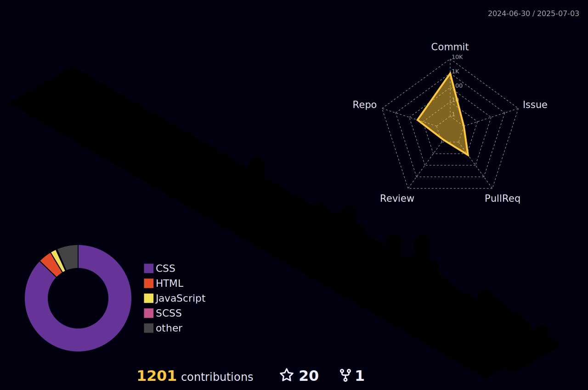

<p align="center">
  
</p>

# Hi, I'm Nzenwata Christopher, a Frontend Web Developer 🖐

<br>

## About Me
I'm just a regular guy on my journey to becoming a full-stack developer. It's a key part of one of my long-term goals. I'm dedicated to improving and expanding my skill set particularly in web development one commit at a time.

```js
//extraInfo

let nzenwataChristopher = {
  otherNames: ['typical developer', 'chris-error-404'],
  pronouns: ['he', 'him'],
  interests: ['coding', 'art', 'gaming', 'movies'],
  education: 'computer science', // still in school
  personality: ['curious', 'creative', 'always learning'],
};

 // I used let instead of const because I'm always evolving ⭐
```
---

<br>

## Currently Learning

> This section highlights the new skills and technologies I'm diving into right now because growth never stops and there’s always something exciting to explore.

<br>


<!---->

---

<br>

## GitHub Stats

> This section shows a snapshot of my coding activity and contributions on GitHub, reflecting my growth and progress over time.

<br>

[](https://git.io/streak-stats)
<br>
<!--

<br>

-->
---

<br>

## Languages & Tools

> These are the technologies and tools I use regularly to build projects, solve problems, and keep improving my skills.

<br>

<p align="left">
  
  
  
  
  
  
  <!---->
  
  <!---->
  <!---->
  <!---->
  
  
  <!---->
  
  
  
  
  
  
</p>

---

<br>

## Contact Me

> Feel free to reach out if you want to collaborate, ask questions, or just say hi. I’m always open to connect!

<br>

<p align="left">
  <a href="mailto:nzenwatachristopher186@gmail.com"></a>
  <a href="https://www.linkedin.com/in/christopher-nzenwata-b52807334/"></a>
  <a href="https://x.com/Chris_Error_404"></a>
  <a href="https://www.instagram.com/typicaldeveloper"></a>
<a href="https://discord.gg/AJUzJ5dq">
  
</a>
</p>

---

<br>

## 3D Graphs Made By Hard Work

> This graph shows my interactions on GitHub. Why is it here? Because it's a cool way to visualize my journey on the platform.

<br>



---
<!--
<br>

## Profile Views

> Counting of visitors to this page since **October 23, 2024**.
> <br />
> But to be clear it counts page hits not unique visitors, I just put it because it looks good.

<br>

<p align="left">
  
</p>

---

<br>

## Visit Counter by Countries

> Map showing country of visitors to this page since **May 27, 2025**

<br>

<a href="https://info.flagcounter.com/WRYg">
  
</a>

---

<br>

## Vist Flag Table

> Table showing country of visitors to this page since **May 27, 2025**

<br>

<a href="https://info.flagcounter.com/WRYg">
  
</a>

---

<br>
-->
## Want to clone this repo?

```bash
# 1. Clone the repo
git clone https://github.com/Chris-Error-404/Chris-Error-404.git

# 2. Navigate into the project directory
cd Chris-Error-404
